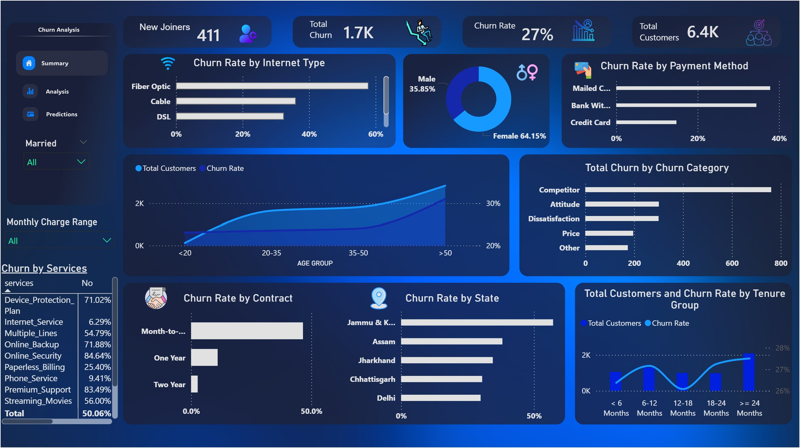

📊 End-to-End Customer Churn Project (SQL + Power BI + Python)

📌 What is this project about?
The main goal of this project is to analyze customer data for a Telecom company to find out why customers are leaving (Churning) and predict who might leave next. This helps the business take action to keep their customers before they go to a competitor.
🚀 How I built it:
1. Data Engineering (SQL Server)
I started by loading the raw data into SQL Server because it's better for handling data than Excel.
Exploration: I wrote SQL queries to see the percentage of customers in different categories like gender, contract type, and state.
Cleaning: I handled all the missing values (NULLs) using the ISNULL function to make the data clean for analysis.
Views: I created specific SQL Views (vw_ChurnData and vw_JoinData) to make it easy to pull data into Power BI and later into Python for Machine Learning.
2. Data Visualization (Power BI)
I connected Power BI to my SQL database and built an interactive dashboard.
Metrics: I used DAX to calculate important numbers like Total Churn, Churn Rate, and New Joiners.
Insights: The dashboard shows that the highest churn happens with customers who have "Month-to-Month" contracts and those who leave for "Competitor Offers".
User Experience: Added tooltips and filters so anyone can drill down into the data easily.
3. Predictive Analytics (Python - In Progress)
The final step is to use Machine Learning to predict future behavior.
Model: I am using the Random Forest algorithm because it's very accurate for this kind of problem.
Goal: To get a list of "High-risk" customers so the marketing team can give them special offers to stay.
🛠️ Tools I used:
SQL Server (SSMS) for data cleaning.
Power BI for the dashboard.
Python (Jupyter Notebook) for Machine Learning.

